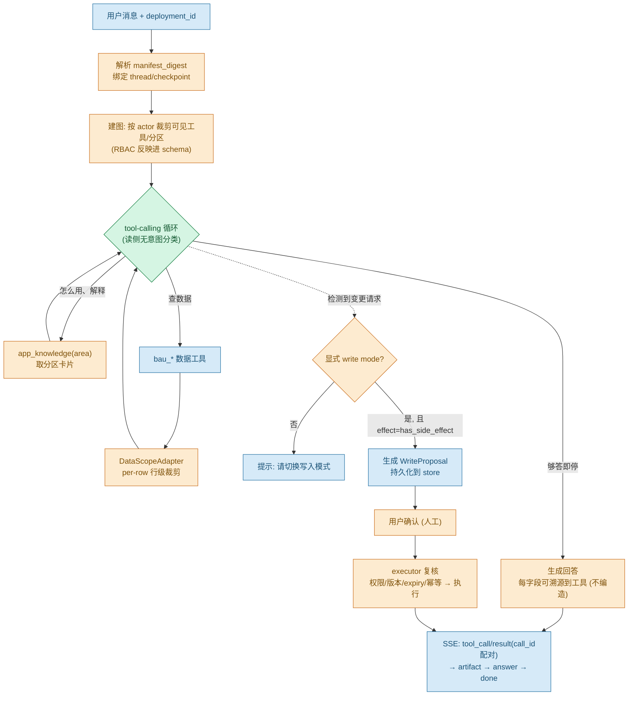
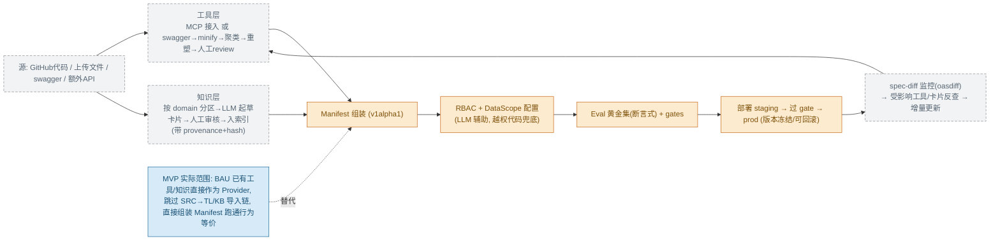

# 架构与工作流图

> 配套 [PLATFORM_DESIGN.md](./PLATFORM_DESIGN.md)（终态）与 [MVP_DESIGN.md](./MVP_DESIGN.md)（近期照做）。
> 用 Mermaid 绘制，VS Code（Markdown Preview Mermaid 插件）/ GitHub 可直接渲染；亦见同目录 `ARCHITECTURE_DIAGRAMS.html`（浏览器直开）。

## 图例（颜色 = 来源）

| 颜色 | 含义 |
|---|---|
| 🟢 绿 | **复用成熟开源**（LangGraph / MCP SDK / Postgres / Langfuse 等，不自造） |
| 🔵 蓝 | **从 BAU(bau_center) 移植**（已验证代码抽取/改造） |
| 🟠 橙 | **自建新内核**（平台差异化，无现成件） |
| ⚪ 灰虚线 | **推迟 / Post-MVP**（带触发器，先不建） |

---

## 1. 项目结构

```mermaid
flowchart TB
  classDef oss fill:#d5f5e3,stroke:#1e8449,color:#145a32;
  classDef bau fill:#d6eaf8,stroke:#2471a3,color:#1a5276;
  classDef core fill:#fdebd0,stroke:#ca6f1e,color:#7e5109;
  classDef later fill:#f2f3f4,stroke:#909497,color:#566573,stroke-dasharray:5 3;

  subgraph L0["客户端 / 前端"]
    direction LR
    chatui["Chat UI + 单一 SSE 渲染器<br/>(assistant-ui / Vercel AI SDK)"]:::later
    studio["Studio 配置前端<br/>(表单 + chatbot 引导)"]:::later
  end

  subgraph L1["API / 契约层"]
    direction LR
    contract["SSE 契约 v1alpha1<br/>run_id · call_id · seq · timestamp"]:::bau
    resolver["deployment_id → 不可变 manifest_digest<br/>(服务端定版, 防降级)"]:::core
    reconnect["SSE 断线恢复<br/>id/Last-Event-ID/重放"]:::later
  end

  subgraph L2["agent_core 运行时 · 自建内核"]
    direction TB
    manifest["Manifest 加载/校验"]:::core
    providers["Provider 接口<br/>Tool · Knowledge · Auth · DataScope"]:::core
    identity["身份三分<br/>Principal · Credential · Execution"]:::core
    reactgraph["LangGraph ReAct 图"]:::oss
    dispatch["dispatcher 路由<br/>(读侧 tool-calling)"]:::bau
    gov["工具治理<br/>去重 · runaway上限25 · artifact 旁路"]:::bau
    llm["LLM 工厂<br/>(langchain-openai / LiteLLM 网关)"]:::bau
    gate["写双门<br/>显式mode AND effect AND 确认 AND executor复核"]:::core
    ckpt["会话 checkpointer"]:::oss
  end

  subgraph L3["Plugin · MVP 仅 BAU 一个"]
    direction LR
    toolprov["BAU ToolProvider<br/>(bau_* 工具)"]:::bau
    knowprov["KnowledgeProvider<br/>(domain card)"]:::bau
    datascope["DataScopeAdapter<br/>per-row 行级裁剪 (不可省)"]:::core
    effect["effect 位 read_only/has_side_effect<br/>(人工审核冻结)"]:::core
  end

  subgraph L4["知识层"]
    direction LR
    cards["分区结构化卡片<br/>主键 domain/entity, UI 仅 source_ref"]:::core
    kstore["索引存储<br/>(Postgres FTS / SQLite FTS5)"]:::oss
    appknow["app_knowledge 工具 (enum 检索)"]:::core
    retr["动态工具/卡片检索<br/>(RAG-MCP, >~30 时)"]:::later
    vec["向量兜底 (pgvector)"]:::later
  end

  subgraph L5["工具接入"]
    direction LR
    mcp["MCP 接入<br/>(MCP SDK + langchain-mcp-adapters)"]:::oss
    oapi["OpenAPI 导入→minify→聚类→重塑→review<br/>(LLM-OpenAPI-minifier)"]:::later
    gw["Tool Gateway (直连现成 API)"]:::later
  end

  subgraph L6["写事务"]
    direction LR
    proposal["WriteProposal + 自有 store + confirm 接口<br/>(BAU 现模型, 不依赖 interrupt)"]:::bau
    txn["写事务状态机<br/>DRAFT→…→COMPENSATION, ETag/TOCTOU"]:::later
    durable["Postgres durable checkpoint<br/>(仅 interrupt 式写需要)"]:::later
  end

  subgraph L7["质量 / 安全 / 同步"]
    direction LR
    evalg["最小 eval gate<br/>工具轨迹/scope/不编造"]:::core
    evaltool["Eval/红队工具<br/>(DeepEval/Giskard/promptfoo/DSPy)"]:::oss
    specdiff["spec-diff → 受影响工具/卡片反查<br/>(oasdiff 引擎)"]:::later
    inject["间接注入全套<br/>DLP/egress/MCP签名"]:::later
    audit["审计 (AgentRun)"]:::bau
  end

  subgraph L8["基础设施"]
    direction LR
    pg["PostgreSQL"]:::oss
    queue["Celery + Redis (异步)"]:::oss
    obs["OTel / Langfuse (可观测)"]:::oss
    auth["Keycloak / Casbin (认证/策略)"]:::later
    secret["Vault / KMS (密钥)"]:::oss
  end

  L0 --> L1 --> L2
  L2 --> L3 --> L4
  L2 --> L5
  L2 --> L6
  L2 --> L7
  L2 -.->|依赖| L8
  L4 --> kstore
  L3 --> effect --> gate
  datascope --> gov
```

---

## 2. 运行时工作流（一次 turn）

---

## 3. 构建工作流（manifest 生产管线 · 多为 Post-MVP）

---

## 4. MVP vs 完整设计 一览

