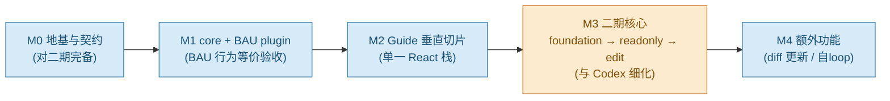

# 实施路线图（详细版 · 含技术细节）

> 状态：路线图 v0.2 · 日期 2026-06-30（v0.2 吸收 Codex 评审：M1 改回 BAU 验收 core、新增 M3-foundation、DataScope 三层、写事务一致性修复、FastMCP、M2 收窄重估）
> 来源：与 manager 商定的路线 + Codex 评审 + 既有设计（[PLATFORM_DESIGN.md](./PLATFORM_DESIGN.md) / [MVP_DESIGN.md](./MVP_DESIGN.md) / 架构图）。
> 总纲：**① 完整 core（对二期完备，由 BAU 验收）→ ② guide 垂直切片 → ③ 二期核心（foundation→readonly→edit）→ ④ diff 更新 + 自loop 优化**。

> **分工**：M0、M1 由 Claude 先推（本文做到可执行级）；**M3 的详细计划由 用户 + Codex 商定**，本文 M3 只给"已定约束 + 待细化项"，不锁死实现。

---

## 0. 对路线的评估与校准（v0.2）

**总体合理**，但 v0.1 有三处被 Codex 正确指出、v0.2 已修：

1. **M1 验收物：BAU plugin，而非玩具 guide bot。**
   manager 改成 "guide 优先" 与 "先做完整 core" 并不冲突——**用 BAU 验收 core 正是"先做完整 core"的最低风险实现**：BAU 是唯一现成、带 per-row DataScope + 写流程的真实消费者，且是"行为等价"这一精确验收基线。玩具 guide 降为**契约冒烟测试**，不替代 BAU 等价验收。guide 仍是第一个"新建"的 bot，放 M2。
   - ⚠️ **唯一需 manager 拍板**：他是否想**刻意跳过 BAU 迁移**（视其为低价值返工）？跳过 = core/DataScope/写得不到真实验证。**推荐：BAU 验 core。**
2. **DataScope 不能"取回后过滤"**（远端会泄越权数据 + 侧信道）→ 改三层（源端授权 / RLS / adapter 后置校验）。
3. **写事务非真 exactly-once**：BAU 现 confirm "先 consume 再 commit"，与 store docstring "先 commit 再 consume" 矛盾，两种都不安全 → M1 必须修（原子 claim + idempotency + outbox）。

核心原则不变：**贵的架构决策现在定，廉价且有触发条件的实现机器推迟；core 由真实消费者（BAU）验证。**

---

## 1. 贯穿全程的原则

- **契约 `v1alpha1`，不宣称"一次定死"**；提供兼容性规则（加字段可、改名/删/改语义为破坏性，需评审）。
- **walking skeleton**：每阶段先打通最薄端到端，可运行可演示。
- **生成物必经人工审核 + eval gate**：卡片/工具/prompt/effect/判据。
- **复用优先**：自建只限内核四件（manifest+core 接线 / per-row 授权 / 反编造 prompt 纪律 / spec-diff 反查）。
- **授权 fail-closed**：未知 effect/scope 默认拒绝；导入的 hints 不可信，权威策略人工冻结。
- **写永不自动**：edit 必经 显式 mode → 草案 → 人工确认 → executor 复核。
- **单一状态真相源**：写流程状态只存一处（proposal store 或 LangGraph checkpoint，二选一），不得双源。
- **不编造**：每个字段可溯源到工具/卡片。

---

## 2. 里程碑总览

> 关键路径 M0→M1→M2 串行（core 由 BAU 验收）。M3 内 foundation 必须先于 readonly/edit。
> 工期相对规模 S≈1–2 周 / M≈3–4 周 / L≈5–8 周 / XL≈8–16 周（按 2–3 人）。给我团队规模/上线时间可换算日历。

---

## M0 · 地基与契约（规模：M · Claude 推）

**目标**：把"改起来贵"的契约与接口一次定到对二期完备（预留缝），但不实现二期机器。

### 交付物
1. **仓库与脚手架**：`agent_core/`、`studio/`、`plugins/<app>/`、`contracts/`、`evals/`。后端 Python 3.12 + FastAPI + Pydantic v2（同 BAU 栈，可复用）；前端 React+TS+Vite。工程：Alembic、pytest、ruff、CI（lint+test+schema 校验）。
2. **Manifest schema（`agentstudio/v1alpha1`）**：`metadata / capabilities[guide|data_read|propose_write] / model / tools(provider,effects,governance) / knowledge(partitions,discovery) / rbac(principal_adapter,data_scope_adapter,visibility) / prompt(discipline_profile,slots) / eval / audit`。**二期预留**：`tenant_id / credential_context / sync / 完整 effects 块 / tool.sources(mcp,openapi)`。
3. **SSE 契约（`v1alpha1`）**：请求 `{deployment_id,message,thread_id?,client_request_id?}`，服务端 `deployment_id→不可变 manifest_digest`；事件 envelope `{schema_version,event,run_id,thread_id,seq,timestamp,data{call_id,...}}`；事件集 `meta→tool_call→tool_result→artifact→answer→error→done`；**预留写事件** `write_proposal/proposal_status`（定义不发送）；thread key `tenant/deployment/subject/thread`+绑 digest。
4. **身份模型（形状定死）**：`Principal{issuer,subject,tenant_id,roles,scopes}` / `CredentialContext{mode,audience,delegated,token_ref}` / `ExecutionContext{deployment_id,manifest_digest,run_id,thread_id}`。
5. **Provider 接口**：`ToolProvider` / `KnowledgeProvider` / `AuthAdapter(可见性)` / `DataScopeAdapter(接口定，实现留 M1/M3)`。
6. **effect 模型（分层，Codex）**：`imported_hints`（来自 MCP/OpenAPI，**不可信**）/ `approved_policy`（人工冻结，权威）/ `runtime_limits`(timeout,max_rows,retry) / `authorization`(required_scopes,data_class) / `write_semantics`(destructive,idempotent,requires_confirmation)。一期只需 `approved_policy.class ∈ {read_only, has_side_effect}`，其余字段预留。未知 fail-closed。
7. **Eval 骨架**：golden = 断言集（工具轨迹/scope/不编造），runner + gate 定义。
8. **第二 app 契约 fixture（纸面）**：一组脱敏 OpenAPI + 不同 RBAC 模型 + ≥1 写例 + per-row 例 + 对应契约测试。**只做 fixture 压测 schema，不建该 app。** 防 BAU-overfit。

### 验收
- manifest/SSE 的 JSON Schema 评审通过、CI 校验生效；
- 两套 fixture（BAU + 第二 app 纸面）都能被 schema 校验、契约测试通过；
- 契约 envelope 单测（含 call_id 配对）通过。

---

## M1 · core 运行时 + BAU plugin（规模：L · Claude 推）

**目标**：agent_core 跑通，并以 **BAU 作为唯一 plugin、行为与今天等价**验收 core；顺带修掉 BAU 写流程的一致性问题。

### M1.1 agent_core 运行时（walking skeleton）
- `create_react_agent`(LangGraph)；prompt = 纪律骨架（写死）+ 槽位；
- 工具封装 `_run`：精确去重、runaway 上限(25)、actor 注入、artifact_sink；
- SSE 事件映射：tool_call/tool_result **call_id 配对**（修 BAU 按名配对 bug）；
- checkpointer：进程内 MemorySaver（durable 留 M3b 触发）；
- 审计 AgentRun；
- Manifest loader：`deployment_id→digest→按 actor 建图`（按可见性裁剪 enum）；
- LLM 工厂：移植 BAU [llm.py](../bau_center/src/core/agent/llm.py)。

### M1.2 BAU 作为第一个 plugin
- `bau_*` 只读工具 → BAU `ToolProvider`；domain 知识 → `KnowledgeProvider`；
- **per-row DataScopeAdapter（实现）**：移植 BAU `fn(session,actor,...)` 的查询级 scope 注入（BAU 已是查询内裁剪，非朴素后过滤——保持）；越权测试入 gate；
- `AuthAdapter`：BAU 角色 → 可见性。

### M1.3 写流程：移植 + 修一致性（必做）
- 现状 bug：[agent_actions.py:69](../bau_center/src/api/routers/agent_actions.py#L69) "先 consume 再 commit"，与 [write_proposal_store.py:58](../bau_center/src/core/agent/write_proposal_store.py#L58) docstring "先 commit 再 consume" 矛盾，两者都非 exactly-once。
- 修复方案（简单单步写，够 BAU 用）：
  1. **原子 claim**：`UPDATE ... SET status='EXECUTING' WHERE token=? AND consumed_at IS NULL RETURNING *`（DB 级 CAS，并发只一个成功）；
  2. **下游 idempotency key**：commit 时携带，使重试安全（at-least-once + 幂等 = effectively-once）；
  3. **transactional outbox**：claim 与"待执行意图"同事务落库；dispatcher 执行并回写结果；失败 → `RECONCILIATION_REQUIRED`，不丢不重复执行；
  4. **单一状态真相源** = proposal store（BAU 不走 interrupt，故 checkpoint 不参与写状态）。
- 状态：`DRAFT→PENDING_APPROVAL→EXECUTING→SUCCEEDED|FAILED|RECONCILIATION_REQUIRED`，`REJECTED/EXPIRED/CANCELLED` 旁路（完整状态机的 edit 扩展留 M3b）。

### M1.4 契约冒烟（玩具 guide bot）
- 单张硬编码卡 + `app_knowledge` 桩，仅验 SSE 契约形状与 eval runner，**不作为 core 验收**。

### 技术选型
LangGraph · langgraph-checkpoint(memory) · langchain-openai · PostgreSQL（claim/outbox 用行级原子更新）· pytest（含 BAU 回归集）。

### 验收（core 由此确立）
- **BAU 回归集在新 core 上全过、行为等价**；
- per-row 越权测试通过；
- 写：草案→原子 claim→执行→结果落库；**注入执行失败**时 token 不丢、可重试/可对账（验证一致性修复）；
- SSE envelope（含 call_id）正确。

---

## M2 · Guide 垂直切片（规模：XL · 收窄到单一 React 栈）

**目标**：为**一个 React+TS 前端**（建议 BAU 前端）产出可用 guide bot。**不承诺通用 ProjectDetector**——先把一个栈做透，多栈适配留后续。

### 子步骤（技术细节见 [GUIDE_ARCHITECTURE_EN.html](./GUIDE_ARCHITECTURE_EN.html)）
- **M2.1 RBAC 可见性 + 身份**（S）：AuthAdapter 按 actor 裁剪 area/工具 enum；纯讲解可不用行级。
- **M2.2 信息摄入（限 React 栈）**（L）：ProjectDetector(只认 React/TS) → 静态(A: ts-morph+react-docgen+i18next-parser+knip信号) + 运行时(B: Playwright 安全浅扫描 per-role) + 视觉(C: 兜底) + OpenAPI 增强(swagger-parser)。
- **M2.3 归一化 + 证据矩阵**（M）：InventoryNormalizer → UIInventory；EvidenceResolver(verified/supported/source_only/runtime_only/conflict/deprecated_candidate/excluded；runtime 出现=强正、缺席=弱负、单信号不判死)。
- **M2.4 Clustering**（M）：TopicPlanner 导航树种子→LLM→主键 domain/entity，UI 仅 source_ref；粒度 eval 验证。
- **M2.5 KB 构建**（M）：CardGenerator(schema 约束 LLM, 五类卡, how-to 仅用有证据 transition)；PostgreSQL+FTS（非向量）。
- **M2.6 分级审核 + Eval gate**（M）：批量(verified) vs 逐张(冲突/单源/含写步骤)；CardValidator 确定性 + LLM 模糊 + guide 回归(拒答不存在功能)。
- **M2.7 访问机制**（M）：app_knowledge(area,topic?) 按 actor 动态 enum + 导航 deeplink + KnowledgeProvider 接库；运行时 guide 问答。
- **M2.8 不可变发布**（S）：KBPublisher.freeze（冻结 commit/OpenAPI digest/scan plan/inventory digest/卡版本/eval/reviewer），runtime 只读 KBRelease。

### 工期重估
通用静态分析 + 多角色 Playwright + 证据矩阵 + 卡片生成 + 分级审核，**对 2–3 人按 XL（8–16 周）估**；若硬压 5–8 周必须再砍范围（例如先只做 A 静态 + 单角色 B）。

### 验收
- React guide bot：how-to/field/nav 全溯源；问不存在功能被拒；过全部 gate；按角色裁剪。

---

## M3 · 二期核心（规模：XL · 由 用户 + Codex 细化）

> 本文只列**已定约束（必须满足）**与**待细化项**；具体实现计划由 用户 + Codex 商定后回填。

### 已定约束（来自 Codex 评审，不可违背）
- **M3-foundation 必须先于 readonly/edit**：CredentialContext/OAuth、源端授权、effect 权威策略、运行预算就位后才接工具。
- **DataScope 三层**：① 数据源/API/MCP server 侧强制授权（主防线）② 直连 PostgreSQL 时优先 RLS（行级、默认拒绝）③ DataScopeAdapter 只做 scope 注入 + 输出后置校验（**非主防线**）。禁止"取回后过滤"作为唯一手段。
- **CredentialContext 真实实现**：service account 与 delegated user token 两模式；token audience/resource 绑定；scope 最小化 + step-up；每请求携带授权；MCP server 自身再校验；**禁透传不属于目标 server 的 token**。复用 MCP Authorization（OAuth 2.1 / Protected Resource Metadata / Resource Indicators / audience），不自造。
- **effect 分层 + fail-closed**：imported_hints(MCP readOnlyHint/destructiveHint/idempotentHint/openWorldHint，**不可信**) → approved_policy(人工冻结权威) → runtime_limits/authorization/write_semantics；未知拒绝。
- **OpenAPI 用 FastMCP**：FastMCP.from_openapi + RouteMap allowlist 生成候选 → 人工设计聚合 façade → contract tests → effect 人工冻结。**默认 1 endpoint=1 tool，必须 façade 重塑（禁 1:1）**。LLM-OpenAPI-minifier 降为实验性预处理。
- **动态检索**：先 capability/tag/role 确定性收窄 + PostgreSQL FTS 描述检索；langgraph-bigtool 仅可替换实验实现。触发条件 = 路由 eval/token 成本/误选率（**非硬性 30**）。
- **WriteProposal 状态机完整**：补 `EXPIRED/CANCELLED/EXECUTION_UNKNOWN(或 RECONCILIATION_REQUIRED)`；**APPROVED 不可编辑**，任何参数变化 → 新 proposal 重审；approval 绑 规范化参数 hash + manifest digest + effect policy 版本 + 目标资源版本(ETag)。`COMPENSATION_REQUIRED` 不作通用承诺（取决于下游可补偿性）。
- **写一致性**：简单单步写 = Postgres 状态机 + 原子 claim + 下游 idempotency + outbox；长周期多审批多步补偿才上 Temporal。**proposal store 与 LangGraph checkpoint 只能一个状态真相源**；M3 前明确二选一。
- **预算治理**：单轮总调用 / max graph steps / wall-clock / token-费用预算 / 并发上限（补在 per-tool 上限之上）。

### 待 用户+Codex 细化
- M3a readonly 与 M3b edit 的拆分与并行度；
- 直连 RLS vs 远端授权的边界（哪些数据源走哪条）；
- Temporal 引入与否的判据；
- effect 权威策略的审核流与存储；
- 第二个真实接入 app 的选择。

### 架构参考
[PHASE2_ARCHITECTURE.html](./PHASE2_ARCHITECTURE.html)（蓝=一期 core/橙=二期新增/灰=触发式）。

---

## M4 · 额外功能（规模：M）

- **M4a diff 更新**：快照+content_hash+source_refs；API 侧 oasdiff、UI 侧 UIInventory diff；ImpactAnalyzer → 受影响卡/工具 → 定向重建 → 审核 → eval → 新不可变发布（不原地改、可回滚）。
- **M4b 自loop 优化**：generate→run→judge→optimize；gold=断言集；工具调用确定性断言、LLM-judge 仅评模糊(rubric+多投票+人工校准)；动作空间分级（prompt→DSPy hold-out；卡片/docstring→diff+人审+hold-out；RBAC/DataScope/重塑→永不自动）；对抗用例 Giskard/PyRIT/garak；闭环 Langfuse；按变更/定时触发。
- **M4c 可观测/成本**（可提前）：OTel+Langfuse；LiteLLM 路由/计量/限流。

---

## 3. 各阶段风险与对策

| 阶段 | 风险 | 对策 |
|---|---|---|
| M0 | 契约对二期想不全 | 用 BAU + 第二 app fixture 双压测；停 v1alpha1 |
| M1 | BAU 写一致性误迁移 | 原子 claim+idempotency+outbox+单一状态源；注入失败用例入 gate |
| M2 | 爬取不可靠/死代码 | 三源证据矩阵；runtime 出现=强正；knip 仅信号；人工兜底 |
| M2 | 范围过大工期失控 | 收窄单一 React 栈；按 XL 估，压不动就再砍 A/单角色 |
| M3 | DataScope 后过滤泄露 | 三层：源端授权+RLS 为主，adapter 仅后置校验 |
| M3 | 远端 MCP 身份缺失/token 透传 | CredentialContext + MCP OAuth audience 绑定，禁透传 |
| M3 | 写失控/双源状态 | 写双门+完整状态机+单一状态源；写永不自动 |
| M4 | 自loop 过拟合 | hold-out 判定；全量 gate；RBAC/工具不自动改 |

---

## 4. 分工与下一步

- **Claude 先推**：M0（契约/schema/接口/fixture）→ M1（core + BAU plugin + 写一致性修复 + 回归）。这两步做完，core 经 BAU 验收成立。
- **用户 + Codex 细化**：M3（foundation/readonly/edit 的具体计划），以本文"已定约束"为护栏。
- **待 manager 拍板一点**：M1 是否用 BAU 验 core（推荐是）还是刻意跳过 BAU 迁移。

---

## 5. 一句话总结
**M0 定死对二期完备的契约/接口（不实现二期机器，含第二 app 纸面 fixture）→ M1 用 BAU plugin 把 core 验到"行为等价"并修掉写一致性 → M2 把 guide 在单一 React 栈做成可用产品 → M3（与 Codex 细化）按 foundation→readonly→edit，守住三层 DataScope/真实身份链/完整写事务三条护栏 → M4 diff 更新与自loop。** 全程 walking skeleton + 人工审核 + eval gate + 授权 fail-closed + 写永不自动。

> 给我团队规模与目标上线时间，我可把 M0/M1 拆成带日历的冲刺与可指派 issue，并先起 M0 的仓库脚手架与 schema。
